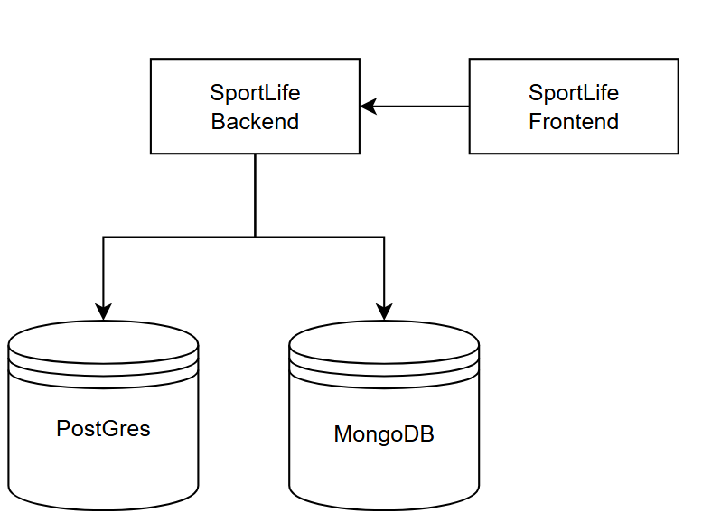
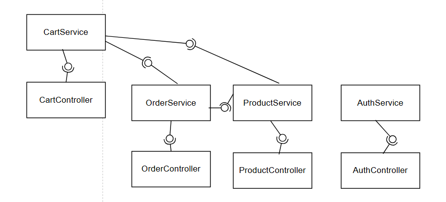
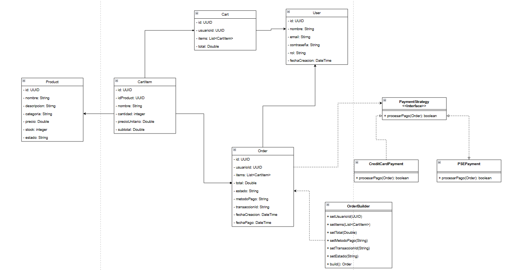
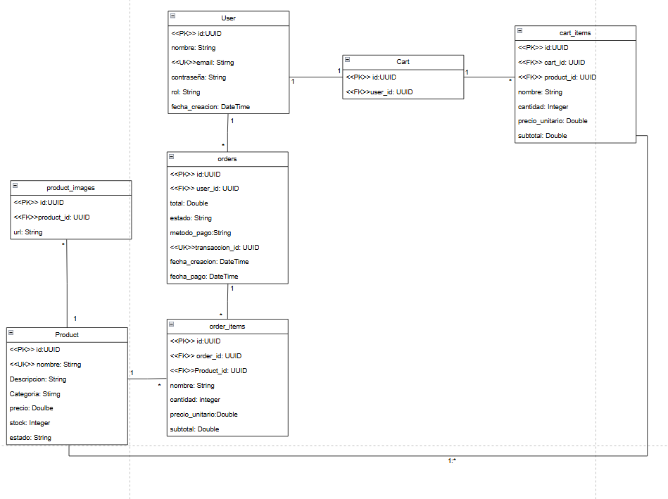
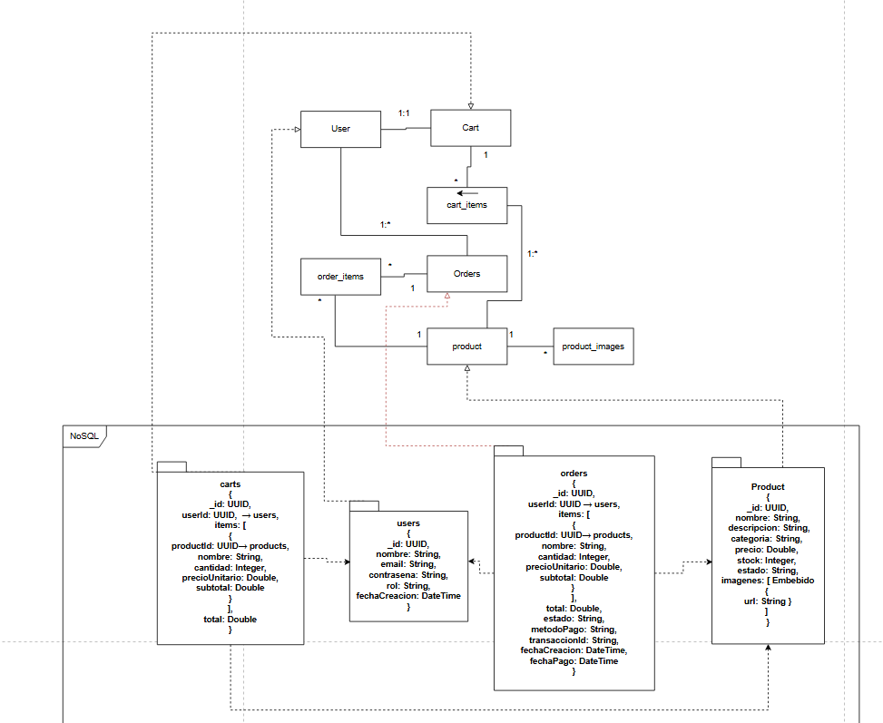

# ECI-SportLife

# Punto 2 — Especificación de Endpoints SportLife

---

## RF-01 — Registro de usuario

**a. Verbo HTTP:** POST

**b. ¿Es idempotente?** No

**c. Razón técnica:** Cada llamada crea un nuevo recurso (usuario) en el sistema. Dos requests con los mismos datos generan conflicto o duplicado, no el mismo resultado.

**d. Datos de entrada y salida:**

| Campo (Request) | Tipo | Obligatorio |
|-----------------|------|-------------|
| nombre | String | SI |
| email | String | SI |
| contrasena | String | SI |

| Campo (Response) | Tipo | Siempre presente |
|------------------|------|-----------------|
| id | UUID | SI |
| nombre | String | SI |
| email | String | SI |
| fechaCreacion | DateTime | SI |

**e. Ejemplo:**

Request:

    {
      "nombre": "Juan Pérez",
      "email": "juan@email.com",
      "contrasena": "Pass123!"
    }

Response 201 Created:

    {
      "id": "a1b2c3d4-...",
      "nombre": "Juan Pérez",
      "email": "juan@email.com",
      "fechaCreacion": "2026-04-09T10:00:00Z"
    }

**f. Validaciones:**
- Input: email con formato válido, contraseña mínimo 8 caracteres con al menos 1 número y 1 mayúscula, nombre no vacío
- Negocio: el email no debe estar ya registrado en el sistema

**g. Códigos HTTP:**

| Escenario | Código | Mensaje |
|-----------|--------|---------|
| Happy Path | 201 | Usuario creado exitosamente |
| Email ya registrado | 409 | El correo ya se encuentra registrado |
| Campos inválidos | 400 | Los datos ingresados no son válidos |
| Error interno | 500 | Error interno del servidor |

---

## RF-02 — Autenticación / Login

**a. Verbo HTTP:** POST

**b. ¿Es idempotente?** No

**c. Razón técnica:** Aunque los datos de entrada sean los mismos, cada llamada genera un nuevo token JWT con diferente tiempo de expiración, por lo tanto el resultado no es idéntico entre llamadas.

**d. Datos de entrada y salida:**

| Campo (Request) | Tipo | Obligatorio |
|-----------------|------|-------------|
| email | String | SI |
| contrasena | String | SI |

| Campo (Response) | Tipo | Siempre presente |
|------------------|------|-----------------|
| token | String (JWT) | SI |
| tipo | String | SI |
| expiracion | DateTime | SI |
| usuarioId | UUID | SI |
| nombre | String | SI |

**e. Ejemplo:**

Request:

    {
      "email": "juan@email.com",
      "contrasena": "Pass123!"
    }

Response 200 OK:

    {
      "token": "eyJhbGciOiJIUzI1NiIs...",
      "tipo": "Bearer",
      "expiracion": "2026-04-09T18:00:00Z",
      "usuarioId": "a1b2c3d4-...",
      "nombre": "Juan Pérez"
    }

**f. Validaciones:**
- Input: email con formato válido, contraseña no vacía
- Negocio: el email debe estar registrado, la contraseña debe coincidir con la almacenada

**g. Códigos HTTP:**

| Escenario | Código | Mensaje |
|-----------|--------|---------|
| Happy Path | 200 | Autenticación exitosa |
| Credenciales incorrectas | 401 | Credenciales inválidas |
| Campos inválidos | 400 | Los datos ingresados no son válidos |
| Error interno | 500 | Error interno del servidor |

---

## RF-03 — Listar productos (filtro por categoría / nombre)

**a. Verbo HTTP:** GET

**b. ¿Es idempotente?** Sí

**c. Razón técnica:** Es una operación de solo lectura. Múltiples llamadas con los mismos parámetros retornan el mismo resultado sin modificar el estado del servidor.

**d. Datos de entrada y salida:**

| Campo (Request) | Tipo | Obligatorio |
|-----------------|------|-------------|
| categoria | String | NO |
| nombre | String | NO |

| Campo (Response) | Tipo | Siempre presente |
|------------------|------|-----------------|
| id | UUID | SI |
| nombre | String | SI |
| descripcion | String | SI |
| categoria | String | SI |
| precio | Double | SI |
| stock | Integer | SI |
| imagenes | List\<String\> | SI |
| estado | String (activo/inactivo) | SI |

**e. Ejemplo:**

Request: GET /productos?categoria=running

Response 200 OK:

    [
      {
        "id": "p1b2c3...",
        "nombre": "Zapatillas Running Pro",
        "descripcion": "Zapatillas para corredores de alto rendimiento",
        "categoria": "running",
        "precio": 250000.00,
        "stock": 15,
        "imagenes": ["url1.jpg", "url2.jpg"],
        "estado": "activo"
      }
    ]

**f. Validaciones:**
- Input: si se envía categoria, debe ser un valor permitido (running, gimnasio, ciclismo, etc.)
- Negocio: solo se retornan productos con estado activo

**g. Códigos HTTP:**

| Escenario | Código | Mensaje |
|-----------|--------|---------|
| Happy Path | 200 | Lista de productos retornada exitosamente |
| Sin resultados | 200 | Lista vacía [] |
| Token inválido / no autenticado | 401 | No autorizado |
| Categoría inválida | 400 | Categoría no reconocida |
| Error interno | 500 | Error interno del servidor |

---

## RF-04 — Ver detalle de un producto

**a. Verbo HTTP:** GET

**b. ¿Es idempotente?** Sí

**c. Razón técnica:** Es una operación de solo lectura sobre un recurso identificado por su ID. Múltiples llamadas retornan el mismo resultado sin alterar el estado del sistema.

**d. Datos de entrada y salida:**

| Campo (Request) | Tipo | Obligatorio |
|-----------------|------|-------------|
| id | UUID | SI |

| Campo (Response) | Tipo | Siempre presente |
|------------------|------|-----------------|
| id | UUID | SI |
| nombre | String | SI |
| descripcion | String | SI |
| categoria | String | SI |
| precio | Double | SI |
| stock | Integer | SI |
| imagenes | List\<String\> | SI |
| estado | String (activo/inactivo) | SI |

**e. Ejemplo:**

Request: GET /productos/{id}

Response 200 OK:

    {
      "id": "p1b2c3...",
      "nombre": "Zapatillas Running Pro",
      "descripcion": "Zapatillas para corredores de alto rendimiento",
      "categoria": "running",
      "precio": 250000.00,
      "stock": 15,
      "imagenes": ["url1.jpg", "url2.jpg"],
      "estado": "activo"
    }

**f. Validaciones:**
- Input: el ID en la URL debe tener formato UUID válido
- Negocio: el producto debe existir y estar en estado activo

**g. Códigos HTTP:**

| Escenario | Código | Mensaje |
|-----------|--------|---------|
| Happy Path | 200 | Producto retornado exitosamente |
| Producto no encontrado | 404 | Producto no encontrado |
| ID con formato inválido | 400 | El identificador proporcionado no es válido |
| No autenticado | 401 | No autorizado |
| Error interno | 500 | Error interno del servidor |

---

## RF-05 — Agregar producto al carrito (validar stock)

**a. Verbo HTTP:** POST

**b. ¿Es idempotente?** No

**c. Razón técnica:** Cada llamada agrega o incrementa la cantidad de un producto en el carrito, modificando el estado del recurso. Dos llamadas iguales no producen el mismo resultado final.

**d. Datos de entrada y salida:**

| Campo (Request) | Tipo | Obligatorio |
|-----------------|------|-------------|
| productoId | UUID | SI |
| cantidad | Integer | SI |

| Campo (Response) | Tipo | Siempre presente |
|------------------|------|-----------------|
| carritoId | UUID | SI |
| productos | List\<ItemCarrito\> | SI |
| total | Double | SI |

| Campo (ItemCarrito) | Tipo |
|---------------------|------|
| productoId | UUID |
| nombre | String |
| cantidad | Integer |
| precioUnitario | Double |
| subtotal | Double |

**e. Ejemplo:**

Request: POST /carrito/items

    {
      "productoId": "p1b2c3...",
      "cantidad": 2
    }

Response 201 Created:

    {
      "carritoId": "c1d2e3...",
      "productos": [
        {
          "productoId": "p1b2c3...",
          "nombre": "Zapatillas Running Pro",
          "cantidad": 2,
          "precioUnitario": 250000.00,
          "subtotal": 500000.00
        }
      ],
      "total": 500000.00
    }

**f. Validaciones:**
- Input: productoId debe ser UUID válido, cantidad debe ser mayor a 0
- Negocio: el producto debe existir y estar activo, la cantidad solicitada no debe superar el stock disponible

**g. Códigos HTTP:**

| Escenario | Código | Mensaje |
|-----------|--------|---------|
| Happy Path | 201 | Producto agregado al carrito exitosamente |
| Stock insuficiente | 409 | Stock insuficiente para la cantidad solicitada |
| Producto no encontrado | 404 | Producto no encontrado |
| Campos inválidos | 400 | Los datos ingresados no son válidos |
| No autenticado | 401 | No autorizado |
| Error interno | 500 | Error interno del servidor |

---

## RF-06 — Ver resumen del carrito

**a. Verbo HTTP:** GET

**b. ¿Es idempotente?** Sí

**c. Razón técnica:** Es una operación de solo lectura sobre el carrito del usuario autenticado. No modifica el estado del sistema y retorna el mismo resultado ante múltiples llamadas sin cambios previos.

**d. Datos de entrada y salida:**

| Campo (Request) | Tipo | Obligatorio |
|-----------------|------|-------------|
| (sin body) | — | — |

| Campo (Response) | Tipo | Siempre presente |
|------------------|------|-----------------|
| carritoId | UUID | SI |
| productos | List\<ItemCarrito\> | SI |
| total | Double | SI |

| Campo (ItemCarrito) | Tipo |
|---------------------|------|
| productoId | UUID |
| nombre | String |
| cantidad | Integer |
| precioUnitario | Double |
| subtotal | Double |

**e. Ejemplo:**

Request: GET /carrito

Response 200 OK:

    {
      "carritoId": "c1d2e3...",
      "productos": [
        {
          "productoId": "p1b2c3...",
          "nombre": "Zapatillas Running Pro",
          "cantidad": 2,
          "precioUnitario": 250000.00,
          "subtotal": 500000.00
        }
      ],
      "total": 500000.00
    }

**f. Validaciones:**
- Input: token JWT válido en el header Authorization
- Negocio: el carrito debe pertenecer al usuario autenticado

**g. Códigos HTTP:**

| Escenario | Código | Mensaje |
|-----------|--------|---------|
| Happy Path | 200 | Carrito retornado exitosamente |
| Carrito vacío | 200 | Carrito vacío |
| No autenticado | 401 | No autorizado |
| Error interno | 500 | Error interno del servidor |

---

## RF-07 — Iniciar proceso de pago (generar orden)

**a. Verbo HTTP:** POST

**b. ¿Es idempotente?** No

**c. Razón técnica:** Cada llamada genera una nueva orden de compra con un identificador único. Múltiples llamadas crean múltiples órdenes distintas.

**d. Datos de entrada y salida:**

| Campo (Request) | Tipo | Obligatorio |
|-----------------|------|-------------|
| metodoPago | String | SI |

| Campo (Response) | Tipo | Siempre presente |
|------------------|------|-----------------|
| ordenId | UUID | SI |
| estado | String (PENDING) | SI |
| total | Double | SI |
| fechaCreacion | DateTime | SI |

**e. Ejemplo:**

Request: POST /ordenes

    {
      "metodoPago": "TARJETA_CREDITO"
    }

Response 201 Created:

    {
      "ordenId": "o1p2q3...",
      "estado": "PENDING",
      "total": 500000.00,
      "fechaCreacion": "2026-04-09T10:30:00Z"
    }

**f. Validaciones:**
- Input: metodoPago dentro de los valores permitidos
- Negocio: el carrito no debe estar vacío, los productos deben seguir teniendo stock disponible al momento del pago

**g. Códigos HTTP:**

| Escenario | Código | Mensaje |
|-----------|--------|---------|
| Happy Path | 201 | Orden generada exitosamente |
| Carrito vacío | 400 | No es posible generar una orden con el carrito vacío |
| Stock insuficiente al pagar | 409 | Uno o más productos no tienen stock suficiente |
| Carrito no encontrado | 404 | Carrito no encontrado |
| No autenticado | 401 | No autorizado |
| Error interno | 500 | Error interno del servidor |

---

## RF-08 — Pago aprobado

**a. Verbo HTTP:** PATCH

**b. ¿Es idempotente?** Sí

**c. Razón técnica:** Actualizar el estado de una orden a PAID con el mismo ID siempre produce el mismo resultado final. Si se llama varias veces, la orden seguirá en PAID sin efectos adicionales.

**d. Datos de entrada y salida:**

| Campo (Request) | Tipo | Obligatorio |
|-----------------|------|-------------|
| resultadoPago | String (APPROVED) | SI |
| transaccionId | String | SI |

| Campo (Response) | Tipo | Siempre presente |
|------------------|------|-----------------|
| ordenId | UUID | SI |
| estado | String (PAID) | SI |
| transaccionId | String | SI |
| resumen | List\<ItemOrden\> | SI |
| total | Double | SI |
| fechaPago | DateTime | SI |

| Campo (ItemOrden) | Tipo |
|-------------------|------|
| productoId | UUID |
| nombre | String |
| cantidad | Integer |
| subtotal | Double |

**e. Ejemplo:**

Request: PATCH /ordenes/{ordenId}/pago

    {
      "resultadoPago": "APPROVED",
      "transaccionId": "TXN-98765"
    }

Response 200 OK:

    {
      "ordenId": "o1p2q3...",
      "estado": "PAID",
      "transaccionId": "TXN-98765",
      "resumen": [
        {
          "productoId": "p1b2c3...",
          "nombre": "Zapatillas Running Pro",
          "cantidad": 2,
          "subtotal": 500000.00
        }
      ],
      "total": 500000.00,
      "fechaPago": "2026-04-09T10:35:00Z"
    }

**f. Validaciones:**
- Input: resultadoPago debe ser APPROVED, transaccionId no vacío
- Negocio: la orden debe existir y estar en estado PENDING, actualizar stock de cada producto

**g. Códigos HTTP:**

| Escenario | Código | Mensaje |
|-----------|--------|---------|
| Happy Path | 200 | Pago aprobado, orden actualizada exitosamente |
| Orden no encontrada | 404 | Orden no encontrada |
| Orden en estado inválido | 409 | La orden no se encuentra en un estado válido para procesar el pago |
| No autenticado | 401 | No autorizado |
| Error interno | 500 | Error interno del servidor |

---

## RF-09 — Pago rechazado

**a. Verbo HTTP:** PATCH

**b. ¿Es idempotente?** Sí

**c. Razón técnica:** Actualizar el estado de una orden a REJECTED con el mismo ID siempre produce el mismo resultado. El stock no se modifica y llamadas repetidas no generan efectos adicionales.

**d. Datos de entrada y salida:**

| Campo (Request) | Tipo | Obligatorio |
|-----------------|------|-------------|
| resultadoPago | String (REJECTED) | SI |
| motivoRechazo | String | NO |

| Campo (Response) | Tipo | Siempre presente |
|------------------|------|-----------------|
| ordenId | UUID | SI |
| estado | String (REJECTED) | SI |
| motivoRechazo | String | NO |
| mensaje | String | SI |
| puedeReintentar | Boolean | SI |

**e. Ejemplo:**

Request: PATCH /ordenes/{ordenId}/pago

    {
      "resultadoPago": "REJECTED",
      "motivoRechazo": "Fondos insuficientes"
    }

Response 200 OK:

    {
      "ordenId": "o1p2q3...",
      "estado": "REJECTED",
      "motivoRechazo": "Fondos insuficientes",
      "mensaje": "El pago fue rechazado. Por favor intente nuevamente.",
      "puedeReintentar": true
    }

**f. Validaciones:**
- Input: resultadoPago debe ser REJECTED
- Negocio: la orden debe existir y estar en estado PENDING, no se debe afectar el stock

**g. Códigos HTTP:**

| Escenario | Código | Mensaje |
|-----------|--------|---------|
| Happy Path | 200 | Pago rechazado, usuario notificado |
| Orden no encontrada | 404 | Orden no encontrada |
| Orden en estado inválido | 409 | La orden no se encuentra en un estado válido para procesar el pago |
| No autenticado | 401 | No autorizado |
| Error interno | 500 | Error interno del servidor |

---

# Punto 3 — Diagrama de Componentes General

---

# Punto 4 — Diagrama de Componentes Específico

---

# Punto 5 — Diagrama de Clases

## Patrones de software implementados

### Builder
Se usó para construir el objeto Order porque una orden no se crea completa de una sola vez,
se va construyendo a lo largo del flujo de pago.
Primero se asigna el usuario y los items, luego el método de pago,
y finalmente el estado y la transacción dependiendo si el pago fue aprobado o rechazado.
Si bien no es indispensable si ayuda a que sea menos complejo el constructor

### Strategy
Se uso para administrar los diferentos tipos de pago (En este caos PSE y tarjeta de credito)
ya que cada uno tiene una logica distinta, ademas suponiendo que se agregen otros metodos de pago a
futuro ayudara agregarlos a futuro sin tener que modificar codigo ya existente.

---

# Punto 6 — Diagrama de Base de Datos

## Modelo Relacional

## Modelo No Relacional

# Punto 7 — Seguridad en SportLife

## Tipos de seguridad a implementar
 
---

### 1. JWT (JSON Web Token)

Es el mecanismo de autenticación. Después del login el servidor genera un token firmado que el cliente envía en cada request en el header Authorization.

Ventajas:
- No requiere guardar sesiones en el servidor (stateless)
- El token contiene la información del usuario y su rol
- Tiene tiempo de expiración, reduciendo el riesgo si es interceptado

---

### 2. BCrypt para contraseñas

Las contraseñas nunca se guardan en texto plano, se hashean con BCrypt antes de persistirlas en la base de datos.

Ventajas:
- Aunque la base de datos sea comprometida, las contraseñas no son legibles
- BCrypt agrega un salt automático, evitando ataques de diccionario y rainbow tables

---

### 3. RBAC (Role Based Access Control)

Control de acceso basado en roles (ADMIN / USER). Cada endpoint valida el rol del usuario autenticado antes de permitir la operación.

Ventajas:
- Principio de mínimo privilegio, cada usuario solo accede a lo que le corresponde
- Evita que un USER acceda a funcionalidades reservadas para ADMIN
- Centraliza la lógica de permisos, facilitando su mantenimiento

---

### 4. HTTPS / TLS

Cifra toda la comunicación entre el cliente y el servidor mediante certificados SSL/TLS.

Ventajas:
- Evita que terceros intercepten datos en tránsito (ataques man-in-the-middle)
- Protege información sensible como contraseñas y datos de pago
- Genera confianza en el usuario al ver el candado en el navegador

---

### 5. CORS (Cross-Origin Resource Sharing)

Controla qué dominios externos pueden consumir la API mediante headers HTTP.

Ventajas:
- Evita que sitios maliciosos hagan requests no autorizados a la API
- Solo el frontend autorizado puede consumir los endpoints
- Protege contra ataques CSRF (Cross-Site Request Forgery)

# Punto 8 — Roles y Permisos en SportLife

## Roles identificados

---

### PÚBLICO (sin autenticación)
- RF-01 — Registro
- RF-02 — Login

---

### USER (usuario registrado)
- RF-02 — Login
- RF-03 — Listar productos
- RF-04 — Ver detalle de producto
- RF-05 — Agregar producto al carrito
- RF-06 — Ver resumen del carrito
- RF-07 — Iniciar proceso de pago
- RF-08 — Pago aprobado
- RF-09 — Pago rechazado

---

### ADMIN (administrador)
- Todo lo del USER
- Gestión de productos (crear, editar, eliminar)

# Punto 9 — TLS/SSL en una API REST

## ¿Cómo funciona TLS/SSL?

TLS (Transport Layer Security) es el protocolo que cifra la comunicación entre el cliente y el servidor. SSL es su predecesor, aunque hoy en día se usa TLS, el término SSL sigue siendo común.

El flujo seria:
1. El cliente se conecta al servidor por HTTPS
2. El servidor presenta su certificado digital
3. El cliente verifica que el certificado sea válido y confiable
4. Se establece una conexión cifrada entre ambos
5. Todos los datos viajan cifrados a partir de ese momento

---

## Spring Boot

1. Se obtiene un certificado SSL (puede ser de Let's Encrypt gratuito o de una CA comercial)
2. Se configura en el application.yml:
    - server.ssl.key-store
    - server.ssl.key-store-password
    - server.ssl.key-store-type
    - server.port=443

---

## Ventajas para SportLife

- Los datos de pago y contraseñas viajan cifrados
- Genera confianza en el usuario
- Es requisito para cualquier pasarela de pago

# Punto 10 — ¿Por qué es importante usar CORS en una API REST?

CORS (Cross-Origin Resource Sharing) es un mecanismo de seguridad del navegador que controla qué dominios externos pueden hacer requests a una API.

Por defecto los navegadores bloquean cualquier request que venga de un dominio distinto al del servidor. CORS permite configurar excepciones a esa regla.
 
---

## Ejemplo sin CORS
- Frontend en https://sportlife.com intenta llamar a https://api.sportlife.com
- El navegador bloquea la request porque son dominios distintos

## Ejemplo con CORS configurado
- Se le indica al servidor que permita requests desde https://sportlife.com
- El navegador permite la comunicación

---

## ¿Por qué es importante en SportLife?

- El frontend y el backend viven en dominios distintos
- Sin CORS ningún request del frontend llegaría al backend
- Evita que APIs externas o sitios maliciosos consuman los endpoints

## tiempo de finalizacion: 4 horas y media